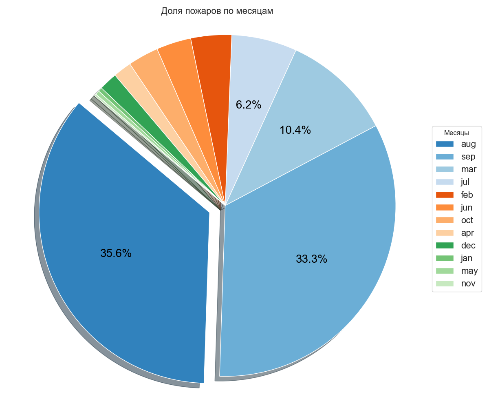

# Анализ данных датасета "Лесной пожар"

## Описание
Этот репозиторий содержит код для загрузки, очистки, анализа и визуализации данных с использованием Python. Мы используем pandas для обработки данных, seaborn и matplotlib для визуализации, а также scikit-learn для обнаружения выбросов и других аналитических задач.

## Функционал
- Загрузка и анализ датасета
- Очистка данных
- Визуализация данных
- Гистограммы и KDE-графики
- Тепловая карта корреляций
- Boxplots и дополнительные визуализации
- Обнаружение выбросов

## Зависимости
Для работы программы необходимы следующие библиотеки:
- `numpy`
- `pandas`
- `seaborn`
- `matplotlib`
- `scikit-learn`

## Установка и запуск проекта
1. Клонируйте репозиторий:
```
git clone https://github.com/Sogato/NNATA-lab1.git
```
2. Создайте виртуальное окружение:
```
python -m venv env
```
3. Установите зависимости проекта:
```
pip install -r requirements.txt
```
4. Запустите программу:
```
python main.py
```

## Пример использования

## Визуализация результатов

#### pairplot


#### histograms and kde temp


#### histograms and kde wind


#### jointplots temp


#### jointplots wind


#### heatmap


#### boxplots RH


#### boxplots temp


#### boxplots wind


#### violinplot


#### stripplot


#### swarmplot


#### pie chart


---

Подготовлено в рамках учебного проекта. Все данные взяты из открытых источников и использованы исключительно в образовательных целях.

---
